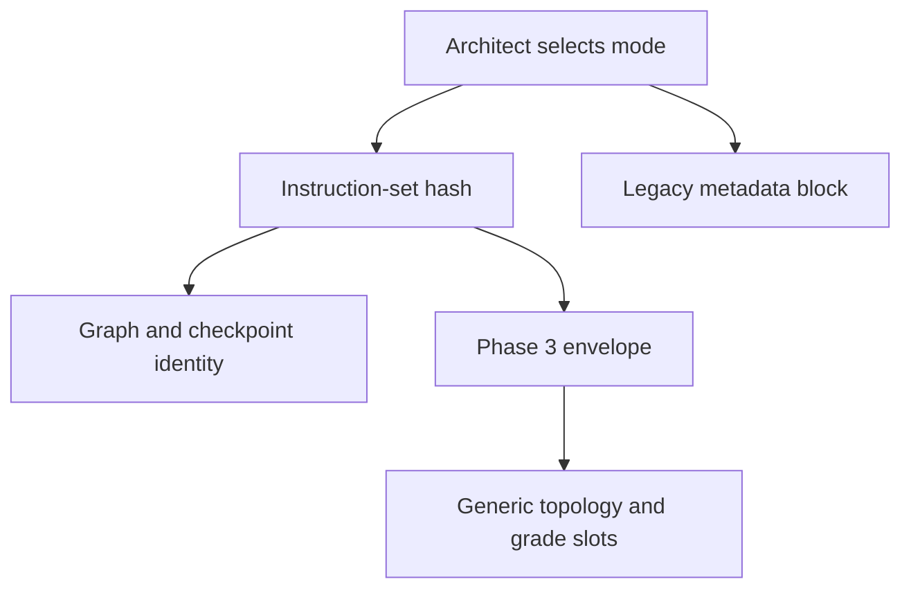

# Step 11 map: language mode

Status: implementation map only. This document records what exists and what
the selected mode reaches; it does not implement the poem/prose adapter.

Evidence basis: `origin/main` at `3aea81e` and PR #229 head `2296bf5` (S1-S7),
checked 19 August 2026.

## 1. Binding destination

`docs/aegis-restructure.md` places language mode inside Phase 2.1 and makes it
a subject adapter, not a second pipeline:

- poem topics follow stanzas;
- meaning-carrying line pairs become concepts with distinct literal,
  metaphorical, line-analysis, setup, device, and vocabulary coverage;
- each stanza has a culmination concept;
- prose topics follow sizeable story breaks and contain significant episodes;
- the final topic is `Detailed Analysis of '<Name>'` with the named analytical
  concepts; and
- grammar, listening, and writing material is threaded through the literary
  concepts.

Those boundaries are semantic. “Stanza,” “pair of lines,” “sizeable break,”
“episode,” and the correct home for grammar material must be model verdicts,
not line counts, heading patterns, or keyword lists.

## 2. What exists

| Component | Current state | Evidence |
|---|---|---|
| Mode selection | Implemented by the Architect as a model-authored `poem|prose|expository` slot with rationale | `instruction_architect.py:1-29,137-184,371-461` |
| Selection schema | Mechanical enum validation; critic dissent is advisory | `instruction_architect.py:295-367,439-460` |
| Persistence and replay | Instruction set is hashed, persisted, and reused when the frozen core matches | `instruction_architect.py:464-548` |
| Run integration | The instruction set is assembled before generation/checkpoint identity and its slots are passed into `generation.concepts_from_mmd` | `build_concepts.py:4265-4313,4434-4471` |
| Legacy prompt visibility | `_metadata_block` renders the selected mode and rationale into legacy `generation.py` API prompts | `generation.py:2485-2566`; `test_instruction_architect.py:554-582` |
| Generic literary guidance | Skeleton/recovery prompts mention story, scene, stanza, episodes, and literary analysis | `generation.py:1259-1361,1363-1394` |
| Semantic graph routing | Subject metadata is deterministically mapped to `language_literature`; graph metadata stores that adapter name | `canonical_source_phase3.py:349-390,944-985,1707-1725` |
| Stable Step 8 identity | Persisted concept IDs are topic-scoped and positional; equal visible names under different topics mint different IDs | PR #229 `identity.py:320-440`; `test_persisted_identity.py:249-261` |

## 3. What the selection currently reaches

The selected `language_mode` is present in the instruction artifact and in the
legacy generation metadata block. Its hash invalidates semantic graphs,
checkpoints, and Phase 3 decisions.

It does **not** yet drive a topology adapter:

1. `canonical_source_phase3_contract.concepts_from_mmd` passes the semantic
   graph only `instruction_set_sha256`, not `instruction_slots`
   (`canonical_source_phase3_contract.py:153-199`). The graph therefore cannot
   read the selected mode or its evidence.
2. Rewritten Phase 3 seals all slots in envelope metadata, but its default
   instruction suffix deliberately emits only `subject_topology_guidance` and
   `grade_band_vocabulary` (`phase3/prompts.py:552-628`). The test pins that only
   those two slots ride Settle/Host rules
   (`test_instruction_architect.py:585-604`).
3. No production module defines poem topics, prose breaks, language facets,
   the final Detailed Analysis topic, or grammar/listening/writing threading.
   A repository search for stanza/rhyme/poetic-device topology finds only the
   Architect selector and generic skeleton prose.
4. The offline Architect intentionally writes an empty mode. That is suitable
   for deterministic tests, but it cannot be treated as a Step 11 result
   (`instruction_architect.py:232-275,390-400`).

The current effect is therefore **record-and-hash plus generic prompt context**,
not the Q9 adapter.

## 4. Existing blockers and residues

### 4.1 Chapter-wide title deletion still forecloses a valid poem map

The Step 8 identity primitive itself passes the required check: two equal
concept names under two topics mint distinct `..._T01_C01` and `..._T02_C01`
IDs. Step 8 therefore did not bake a chapter-wide title into identity.

The pipeline around it still forecloses the case at PR #229 S7:

- `_dedupe_titles_chapter_wide` mechanically keeps the first normalized title
  across the entire chapter and drops later rows
  (`generation.py:16616-16655` on the PR head).
- `concept_validator` reports every chapter-wide duplicate title as an error
  (`concept_validator.py:1640-1653`).
- publication still resolves by normalized title anywhere in the chapter,
  then reparents and overwrites the first row
  (`build_concepts.py:552-567` and
  `build_concepts_release_publication.py:160-197` on the PR head).

PR #229's Step 8 spec assigns the publication join to S10 and deliberately
leaves `_dedupe_titles_chapter_wide` for Step 11. Until both are retired, two
stanzas that legitimately teach a concept named `Courage` cannot survive end
to end as two concepts.

### 4.2 English culmination recognition substitutes wording for role

- `_GENERIC_SKELETON_FAMILY_RE` excludes a family by matching English words
  including `culmination` (`generation.py:15849-15895` on PR #229).
- `concept_refiner.is_culmination` recognizes a culmination from an English
  title prefix, and downstream code relies on it.
- `coverage_ledger` and workbook validation also infer culmination from title
  text in places.

Step 11 needs an explicit, recorded semantic role. Translated titles and a
normal concept whose teaching happens to use the word “culmination” must not
change structure.

### 4.3 Subject adapter routing is vocabulary-based

`canonical_source_phase3.subject_adapter` maps the subject field with an
English keyword list (`canonical_source_phase3.py:349-390`). The field is
user-selected metadata rather than textbook content, so this is less dangerous
than content classification, but it still omits Marathi from its language list
and cannot be the evidence that a chapter is poem or prose. The Architect's
model verdict must remain the mode authority.

### 4.4 Text question extraction is a prerequisite defect

For `.mmd`, `.md`, and `.txt`, the Phase 2 inventory is built from
`_source_task_anchors` and the model extractor is bypassed. Language exercises
outside finite English cues can therefore disappear before Step 11 can thread
them. The repair is specified separately in
`docs/spec-question-extraction.md` and must precede Step 11 acceptance.

## 5. Data currently available to an adapter

An adapter can reuse, rather than recreate:

- the Architect's selected mode, rationale, instruction hash, critic flags,
  board/publication guidance, grade vocabulary, and chapter cautions;
- canonical blocks with stable source IDs, spans, ordering, figures, and math;
- the semantic graph's topics, subtopics, source blocks, and task/QID links;
- the question inventory and polished source wording;
- the rewritten Phase 3 envelope, decision store, author/critic/Fixer
  machinery, and exact-once ledgers; and
- Step 8's persisted topic/concept machine-ID minter.

It must not use a generated row count, page count, line count, chunk count, or
English label as a substitute for a topology verdict.

## 6. Validation gap

There is no live acceptance artifact for a real poem or for *The Elevator*.
Current Architect tests use scripted responses and prove schema, hashes,
critic polarity, and prompt transport, not semantic topology. The final Step 11
validation therefore requires a live provider and full real chapters. The
acceptance contract is defined in `docs/spec-step11.md`.

