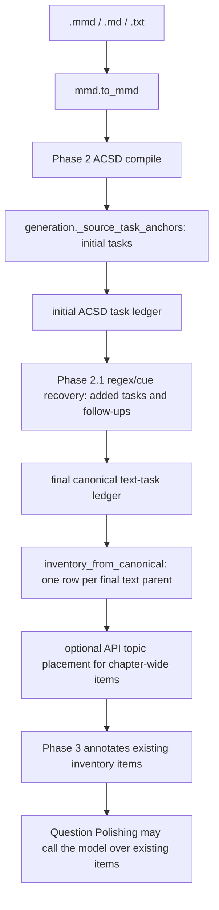

# Question extraction: semantic inventory specification

Status: specification only; no implementation is included here.

Evidence basis: PR #229 at `d5cfafe`, checked 19 August 2026. This head includes
S10's converged publication and Step-8 slice S11's polarity inversion. The
previously referenced `docs/map-question-extraction.md` was not present on
PR #229 at that head, so every central claim below was re-checked against the
branch implementation rather than inherited from that map or from `main`.

## 1. Decision

Question/task membership for `.mmd`, `.md`, and `.txt` inputs must become a
model verdict over the complete source-block ledger. Deterministic parsing may
continue to recover spans, labels, ordering, figures, and candidate boundaries,
but it must not decide whether a block is a learner task and must not be the
only way a task enters the inventory.

The repair belongs to a dedicated **Step 2 follow-up slice**: semantic
question-inventory extraction for text sources. It is not Step 8 release work,
and it must not be hidden inside the restructure's Step 11 language-mode
adapter. It should land before that adapter because language chapters and
non-English editions are among the inputs most exposed to the current finite
English cue vocabulary.

The recommended design is a closed-world, block-by-block author verdict plus
an advisory critic:

1. Present every canonical source block, in reading order, to the inventory
   author with stable block IDs and bounded neighbouring context.
2. Require a verdict for every block: `task`, `task_context`, `not_task`, or
   `part_of_task`, with the referenced task occurrence and source evidence.
3. Reconcile the verdicts mechanically into exact source spans. Assign stable
   QIDs, order, labels, and figure references only after the verdicts exist.
4. Run an independent critic over the complete accounting. Critic dissent is a
   review flag, never a gate (Q10).
5. If a semantic decision remains unresolved after the bounded correction,
   invoke the real Fixer once with the complete block and decision context.
   Record its best-judgment verdict, flag the affected occurrence, and complete
   the run (Q13). Membership, completeness, boundary, and context uncertainty
   are semantic findings; they must not be recast as `required` or
   `required_parent` merely to enter Step-8 slice S11's blocking allow-list.
6. Prove exact-once accounting: every source block is either represented in an
   inventory item, explicitly attached as context, or explicitly ruled
   `not_task`. No parser miss may disappear without a model verdict (R4).

## 2. Verified current mechanism

The production call graph for text-shaped uploads is:



The central facts are not inferred from names or docstrings. Re-measurement at
`d5cfafe` preserves the doctrine finding but narrows three earlier absolutes:
the active wrapper can call a model for **topic placement** after membership
already exists, and the final inventory is not 1:1 with the **initial anchor
list** because Phase 2.1 can append parents that `_source_task_anchors` missed.
That recovery is itself driven by finite cue regexes rather than a closed-world
model verdict. On direct text, the final inventory does remain one row per
final canonical parent; model-ruled multi-row boundaries are PDF-only on a
fresh run today. Phase 3 and Question Polishing are later model-bearing stages,
but neither is the missing closed-world parent-membership author. A restored
legacy inventory carrying old `polish_fragments` can still be expanded during
polishing; that compatibility path is not evidence that current text extraction
authors membership semantically.

| Claim | Code evidence | Consequence |
|---|---|---|
| Text uploads are read as text, without the PDF reader | `backend/app/services/mmd.py:28-47,51-75` | `.mmd`, `.md`, and `.txt` enter the ordinary MMD compiler. |
| Initial ACSD tasks originate in the deterministic anchor parser | `canonical_source.py:588-721,1037-1043`; `canonical_source_phase2.py:114-132` | The Phase 2 ledger starts from `generation._source_task_anchors`, but this is not its only deterministic membership pass. |
| Phase 2.1 can append tasks and follow-ups through more vocabularies | `canonical_source_phase21_structure.py:16-29,74-96,279-390,944-1039`; active calls at `canonical_source_phase21.py:97-116` | `_CUE_RE` can append a new parent task, while an English cue-heading plus `?`/imperative test can attach additional prompts. These are recorded and sometimes flagged, but no model made their task/not-task decision. |
| The production inventory extractor is rebound at import | `canonical_source_phase2_contract.py:27-44,134-192,258-267`; install order in `services/__init__.py:97-110` | During an active Phase 2 run, `_extract_question_task_inventory_via_api` calls `inventory_from_canonical` rather than its original extraction author. Lines `154-163` can still call the API to assign already-existing chapter-wide items to topics. |
| The no-author-call test is deliberately scoped | `backend/tests/test_canonical_source_phase2.py:260-288` | Its fixture has no chapter-wide item and forbids `_openai_json`; it proves the extraction-author bypass on that path, not that every inventory-shaped input makes zero provider calls. |
| Direct-text follow-up leaves do not create extra inventory rows | `_never_split_questions` at `canonical_source_phase2.py:660-664`; merge at `:717-807`; the only `gpt_boundary_parts` writer is `canonical_source_phase221_fallback.py:3102-3104` | Deterministic direct-text follow-ups are merged back into their parent row. Multiple model-ruled rows exist only on the PDF page-ledger lane at this commit. |
| Phase 3 only annotates that result | `canonical_source_phase3_contract.py:41-45,348-356,428-435`; `canonical_source_phase3.py:4977-5093` | The semantic graph does not discover parent tasks absent from the Phase 2 ledger. |
| Question Polishing is a downstream model call, not the missing membership author | `question_polishing_contract.py:39-56`; `question_polishing.py:306-320,468-532` | Current decisions polish existing rows and do not add or split fresh membership. The compatibility expansion at `question_polishing.py:324-379` applies only when a restored inventory already carries `polish_fragments`. |
| PDF has a different recovery authority | `canonical_source_phase221_fallback.py:2790-2875,3330-3367` | A verified GPT page task can be created even when the parser found no candidate. |

The existing API extractor in `generation.py` still performs a model
extraction and completeness review, then merges deterministic anchors
(`generation.py:7370-7542`). Under the active Phase 2 contract, however, that
function body is not the production inventory author for a text upload. The
precise claim is therefore **no live model is the closed-world task-membership
author on the active text path**, not “the rebound function can never call an
API” and not “every final item is 1:1 with the **initial**
`_source_task_anchors` result.” Its
chapter-wide call at `canonical_source_phase2_contract.py:154-163` assigns a
topic to a task the ledger already supplied; Phase 2.1's extra membership
comes from deterministic cue recovery, not that API call.

The central rebind correction is reproducible without importing the service:

```bash
git show d5cfafe:backend/app/services/canonical_source_phase2_contract.py | nl -ba | sed -n '27,44p;134,192p;258,267p'; git show d5cfafe:backend/app/services/canonical_source_phase21.py | nl -ba | sed -n '97,120p'; git show d5cfafe:backend/app/services/canonical_source_phase21_structure.py | nl -ba | sed -n '1,29p;74,96p;279,390p;944,1039p'; git show d5cfafe:backend/app/services/generation.py | nl -ba | sed -n '7370,7542p'
git grep -n 'gpt_boundary_parts' d5cfafe -- backend/app/services; git show d5cfafe:backend/app/services/canonical_source_phase2.py | nl -ba | sed -n '660,664p;717,807p'; git show d5cfafe:backend/app/services/question_polishing.py | nl -ba | sed -n '306,379p;468,532p'
```

### 2.1 The semantic decisions currently made by patterns

The parser does more than recognize syntax:

- `_QUESTION_SENTENCE_RE` admits only named English interrogatives and
  auxiliary verbs and imposes `{8,800}` character bounds
  (`generation.py:4414-4421`).
- `_STANDALONE_CHECKPOINT_DIRECTIVE_RE` is an English imperative vocabulary
  (`generation.py:4434-4439`).
- `_CHECKPOINT_CONTAINER_HEADING_RE`, `_TASK_LIST_CONTAINER_RE`, and
  `_CHAPTER_WIDE_TASK_HEADING_RE` decide where task parsing is active from
  finite English heading vocabularies (`generation.py:4388-4413`).
- The headingless recovery lane adds more English phrases, stop words,
  content-specific token sets, and numeric text bounds
  (`generation.py:4593-4704,4707-4754,4757-4876`).
- `_source_task_anchors` uses those results to create the only tasks that reach
  the **initial** text-lane ACSD ledger (`generation.py:5259-5842`). It also
  contains English-only branches for activity/project headings and task
  scoping.
- Phase 2.1 then applies another English cue vocabulary. `_CUE_RE` appends a
  new task directly; `_TASK_CUE_HEADING_RE`, `_IMPERATIVE_RE`, and the presence
  of `?` decide whether sibling blocks become task follow-ups
  (`canonical_source_phase21_structure.py:16-29,74-96,279-390,944-1039`).

These are content-membership decisions under Rule 1, even where comments call
them structural gates. They decide whether a learner-visible ask exists at all.
For direct text, `inventory_from_canonical` merges deterministic follow-up
`leaf_cases` back into one row per final parent. Phase 2.1 can nevertheless
append cue-matched parents, so “final inventory is 1:1 with the initial anchor
list” is false. The narrower and load-bearing statement is that a source block
missed by **both deterministic membership passes** has no later closed-world
model authority that can add it. The only current `gpt_boundary_parts` writer
that can produce multiple model-ruled rows is the PDF fallback
(`canonical_source_phase221_fallback.py:3102-3104`).

Concrete loss cases include:

- `# विचार करा\nपाण्याचे महत्त्व स्पष्ट करा.` — an unnumbered Marathi task
  with neither an English container heading nor an English interrogative cue;
- `Compare the two accounts.` in an otherwise ordinary unlabelled paragraph —
  a single imperative ask outside a recognized container;
- a legitimate question outside all recognized container/cue recovery paths
  whose printed wording falls below 8 or above 800 characters after its cue;
  and
- a publisher-specific callout with no `?`, English task-list heading, or
  recognized `Activity`/`Project` label.

For PDFs, the code itself records the asymmetry: the fallback says the legacy
parser “recognises a finite cue vocabulary,” then creates a task directly from
the verified page ledger (`canonical_source_phase221_fallback.py:2845-2874`).
There is no equivalent authority for direct text uploads.

### 2.2 S10 identity and Step-8 S11 polarity boundaries

S10 does not repair or invalidate the extraction finding, but it makes an
identity boundary explicit. A source QID identifies one source-task occurrence;
a concept `machine_id` identifies one persisted concept home. Current Phase 2
assigns source-ordered ordinal QIDs (`canonical_source_phase2.py:191-219`) and
validates the sequence (`:335-343`). S10 publication does not resolve concepts
by QID. Its order is: carried persisted `machine_id`; otherwise exactly one
unclaimed normalized-title match within the resolved topic; otherwise create
(`build_concepts_release_publication.py:401-499`). QX must not derive either
identity from the other or reuse S10's title fallback to decide task membership
or occurrence equality. Multiple QIDs may legitimately route to one concept.

The release payload is one current Concept-lane QID audit carrier:
`build_concepts_release.py:101,118-123,1281-1291,1695-1710` records the field,
and `_strip_release_fields` removes release-only audit fields before Concept
upsert (`:3119-3124`). `models.Concept` has no source-QID column
(`models.py:68-90`), while assessment `Question` rows separately persist
`source_qid` (`models.py:130-179`). `_aegis_release_qids` is only a per-concept
routing/audit list; it contains no membership verdict, source evidence, critic
dissent, or Fixer record. QX needs a separate durable ledger and must not
overload that list. The Concept table is not the verdict-ledger carrier.

The downstream cutover policy is open. Existing immutable AssessmentRelease
payloads and published `Question.source_qid` values may carry parser-era
ordinals. QX must either scope the new contract to new runs or supersede and
rebuild downstream artifacts; it must never silently rewrite frozen history.
The current assessment-republication policy was not sufficient to verify which
choice is safe.

Step-8 slice S11 has landed at this evidence head, but its polarity inversion
is narrower than “every judgment code flags.” `_BLOCKING_CODES` is exactly
`{required, required_parent}` (`generation.py:12908-12912`). It partitions only
error-severity members of `_FATAL_CODES`; every advisory finding is logged and,
when its `row_index` resolves, carried on that row
(`generation.py:12967-13026`). The same split controls the final gate
(`:15770-15819`). It is a concept-validation allow-list, not an extraction
fallback policy.

The legacy extraction author still raises when its semantic completeness
reviewer returns no allowed verdict (`generation.py:6935-6939`; concrete
response `{}` or `{"verdict": "uncertain"}`), when completeness remains negative
after retry (`:7458-7466`), and when rows remain invalid after the mixed
adjudication path (`:7516-7535`). The validity helper mixes empty-task findings
with object/QID shape defects (`generation.py:13318-13373`), and a missing-QID
row bypasses semantic adjudication (`:6981-6983`). Later
`invalid_source_inventory` and exact-coverage gates also remain independent of
`_BLOCKING_CODES` (`generation.py:15820-15877`). QX must therefore author and
persist its own polarity:

- author uncertainty after one bounded correction invokes the Fixer once,
  records one best-judgment verdict with source evidence, flags the occurrence,
  and completes;
- critic dissent only adds a flag; it cannot retry, correct, adjudicate, erase,
  or halt (Q10); and
- only genuine impossibility — an unreadable source, unavailable provider,
  exhausted quota, or a decision contract that cannot be made mechanically
  applicable — may stop without a best-judgment verdict. Semantic uncertainty
  in an otherwise applicable verdict is none of those and must not restore
  parser ownership (Q13/R4).

One integration point remains open: the present code does not decide whether
QX reconciliation will make an empty/non-object row or
malformed/missing/duplicate inventory identity
impossible before the active wrapper's current refusals
(`canonical_source_phase2_contract.py:167-184`) and the later gates, or whether
those sites need a QX-specific recorded-defect transport. What is not open is
their semantic polarity: task membership, boundary, context, and completeness
doubt must flag rather than halt.

The generation coordinates above were re-pinned together at the Step-8 S11
head:

```bash
git show d5cfafe:backend/app/services/generation.py | nl -ba | sed -n '4388,4439p;4593,4704p;4707,4754p;4757,4876p;5259,5842p;6902,6948p;6970,6990p;7370,7542p;12863,13026p;13318,13373p;15748,15877p'
```

## 3. Invariants

The replacement must preserve these contracts:

1. **Model-owned membership.** Whether source content asks the learner to do
   something is always an author-model verdict. No regex, keyword list,
   punctuation check, text length, heading spelling, or count may include or
   exclude it.
2. **Closed-world evidence.** Every canonical block receives a verdict. A
   sampled or parser-nominated subset is insufficient because the parser's
   omissions are the defect being repaired.
3. **Source fidelity.** Inventory display text is recoverable from source spans
   and may be normalized only by already-approved lossless presentation rules.
4. **Whole questions.** A printed question with subparts remains one question,
   unless a model verdict explicitly identifies independent asks under the
   binding never-split policy.
5. **Exact once.** Each assessable source occurrence has one inventory identity.
   Repeated wording at two source locations remains two occurrences.
6. **Replay-stable mechanics.** QID minting, source ordering, span addressing,
   figure attachment, caching, schema validation, and replay remain
   deterministic for a fixed adjudicated ledger. The QX cutover invalidates
   every parser-authority inventory checkpoint even if the adjudicated
   membership and ordinal QIDs happen to be unchanged. Re-keying source QIDs
   must not remint an existing persisted concept, or make it appear new, solely
   because its source QIDs changed; a genuinely new or explicitly restored
   concept still follows S10's ordinary create/restore-or-mint path.
7. **No silent fallback.** Provider unavailability is a named genuine
   impossibility. Semantic uncertainty after a successful provider call is a
   flagged decision, not “provider failure,” and must not reinstate parser
   ownership or halt the run.
8. **Decide once.** Author, critic, correction, and Fixer records are
   content-addressed by source contract, source/block hashes, prompts,
   instruction-set hash, provider/model identity, and schema version.
9. **Critic advises.** A critic rejection adds a review flag and cannot erase
   or block the author's inventory.
10. **Lane parity.** PDF and text sources satisfy the same semantic inventory
    contract even if their evidence acquisition differs.
11. **Explicit polarity.** Every extraction-specific semantic issue has a
    durable flag consumer. Step-8 S11's `_BLOCKING_CODES` does not classify it by
    implication.
12. **Separate identities.** Source QIDs are occurrence identities; concept
    machine IDs are persisted-home identities. Neither is a fallback for the
    other.

## 4. Options and costs

| Option | Provider cost | What it fixes | What still breaks | Verdict |
|---|---:|---|---|---|
| A. Keep the deterministic text parser | None for inventory | Nothing | Finite English cues and character bounds remain the sole membership authority; direct text and PDF disagree | Reject |
| B. Restore the legacy API extractor only | One or more author calls plus completeness calls per chapter | A model can discover asks outside parser cues | The existing chunk path still merges parser anchors as mandatory inclusions; its completeness/validity flow still raises after spend at `generation.py:6935-6939,7458-7466,7516-7535`, outside Step-8 S11's polarity split, and it does not account for every block | Transitional only |
| C. Parser candidates plus a model “gap scan” | Author call over only unmatched prose | Recovers some misses cheaply | The parser still decides which source deserves review; false-negative regions remain invisible, so R4 is not proven | Reject as final design |
| D. Closed-world block verdicts, deterministic reconciliation | One author pass, one critic pass, bounded correction/Fixer only when needed; cacheable by block/source hash | Removes cue vocabulary and bounds from membership while retaining stable spans and IDs | Requires new decision artifacts, prompt/schema work, checkpoint invalidation, and live acceptance runs | **Adopt** |
| E. Reuse the PDF page-ledger implementation literally for every text file | Similar to D, with extra conversion abstractions | Creates one nominal reader | Text has no pages, bounding boxes, or OCR uncertainty; pretending it does increases surface area and loses native character spans | Reject; share the semantic contract, not the evidence format |

Option D can batch blocks to control cost. Batching is transport only: batch
size must not decide how many questions exist or where task boundaries fall.
Oversized blocks must be losslessly windowed with overlap/evidence addressing,
then reconciled by stable block/span identity.

## 5. Required re-authoring

This is a contract replacement, not a single call-site edit.

### 5.1 Source and inventory artifacts

- Re-author Phase 2 task construction so `_source_task_anchors` yields
  **candidates and mechanical source locations**, not the canonical task set.
  The same change must demote Phase 2.1's `recover_plain_task_cues`,
  `recover_followup_task_prompts`, and `is_task_like` from membership authority
  to candidate/span evidence; fixing only the first parser leaves the wider
  deterministic recovery vocabulary in charge.
- Add a text-source task-verdict ledger parallel in authority to the verified
  PDF page ledger. Each verdict must retain block IDs, source spans, task/context
  relationships, rationale, review flags, prompt/schema versions, and decision
  hash.
- Build `canonical["tasks"]` from verdicts plus deterministic reconciliation.
  `inventory_from_canonical` may remain a renderer after that change.
- Record explicit `not_task` verdicts or a compact content-addressed accounting
  artifact so “no questions here” is distinguishable from “not read.”
- Make extraction provenance state the actual author and critic mode; the
  current “deterministic ACSD task ledger” wording must retire for text runs.

### 5.2 Runtime wiring

- Replace the import-time Phase 2 rebinding contract that bypasses the
  extraction-author API. The production function name must describe what it
  does; keeping `_via_api` while the wrapper builds membership without that API
  is actively misleading even though chapter-wide topic placement may still
  make a later API call.
- Ensure Phase 3 consumes the adjudicated task ledger and cannot annotate a
  parser-only fallback as semantic extraction.
- Thread the Architect instruction identity and relevant language/board slots
  into decision keys and requests.
- Re-key question-inventory checkpoints. A checkpoint created under parser
  authority cannot be reused as if a model had judged it.
- Preserve Question Polishing as a later wording pass. It cannot repair an ask
  that never entered the inventory.
- Replace the semantic completeness non-decision and post-retry raises at
  `generation.py:6935-6939,7458-7466` with the flag-not-halt Fixer contract. Do
  not assume `_BLOCKING_CODES` reaches these paths. A missing/unknown verdict,
  under-extraction, or boundary doubt after correction produces one recorded
  Fixer verdict and review flag, then the run completes.
- Split the mixed validity refusal at `generation.py:7516-7535` by mechanism.
  Empty-task/membership doubt is semantic and follows the same flagged Fixer
  path; non-object and malformed/missing/duplicate-QID defects require
  mechanical repair or a truthful structural-defect record, never blind
  accept-with-flag. Pre-spend source unreadability may stop as a genuine
  impossibility; provider unavailability, exhausted quota, or a decision
  contract that cannot be made mechanically applicable may arise later and
  must be recorded by their actual mechanism.
- Resolve the open boundary at the later inventory gates
  (`generation.py:15820-15877`): either make empty/non-object rows and
  malformed/missing/duplicate identity impossible during reconciliation or
  give genuine structural defects a truthful recorded transport. Do not route
  semantic doubt through a structural code just to stop the run.
- Keep source QID migration separate from S10 concept publication. Invalidate
  and re-key every parser-authority inventory checkpoint and supersede/re-stage
  each downstream artifact that carries its QIDs, even if the adjudicated
  membership happens to match. Never mutate an immutable frozen release or
  remint an existing persisted concept solely because source QIDs changed; a
  genuinely new or restored concept still uses S10's ordinary
  create/restore-or-mint path.

### 5.3 Tests and fixtures

Tests that treat `_source_task_anchors` as the oracle must be re-authored around
recorded model verdicts. In particular,
`test_active_generation_inventory_bypasses_model_extraction` must invert: a
live text-source run must prove the semantic author was called, while a replay
must prove the stored verdict is reused without a call.

Parser tests remain useful only for span recovery, list-label parsing, figure
attachment, and candidate provenance. They must not assert that the absence of
a regex match means the absence of a question. Phase 2.1 tests for
`recover_plain_task_cues` and `recover_followup_task_prompts` require the same
migration: cue matches may nominate exact spans, but cannot author membership.

Polarity regressions must separately prove:

- critic dissent yields one durable flag, no retry, and no halt;
- author uncertainty after its bounded correction yields one Fixer record and
  a completed run;
- an absent/unknown completeness verdict and the under-extraction path cannot
  raise merely because the semantic verdict is uncertain;
- provider unavailability produces a named genuine-impossibility stop and no
  parser-authored checkpoint; and
- every extraction issue reaches a durable review surface. A run-log line with
  no later reader is not sufficient.

## 6. Validation and live-provider requirement

A live provider is **required for acceptance**. Unit tests with scripted
providers can validate schema, accounting, QID stability, cache replay,
critic polarity, and Fixer transport, but they cannot establish that the new
semantic author understands real publisher variation.

The acceptance set must contain complete, real chapters rather than synthetic
one-line prompts:

- one `.mmd`, one `.md`, and one `.txt` source;
- English, Marathi, and Hindi learner asks;
- interrogatives, imperatives, activity instructions, reflective prompts,
  table/figure-dependent tasks, and publisher-specific callouts;
- asks without `?`, asks outside familiar headings, and long multipart asks;
- rhetorical questions that must be ruled `not_task`;
- identical wording at two source locations; and
- the same PDF and text transcription where available, compared for inventory
  occurrence parity rather than byte-identical representation.

For every run, reviewers must be able to inspect:

- all source-block verdicts;
- inventory items and their exact source occurrences;
- critic dissent and Fixer interventions;
- zero unaccounted blocks; and
- a no-spend replay producing the same QIDs for the same adjudicated ledger,
  without changing an existing concept machine ID solely because a source QID
  changed.

The validation report must name any claim that requires the broader staging
corpus. The full test suite is not evidence for semantic extraction quality.

## 7. Slice plan

1. **QX1 — contract and artifacts.** Define the block-verdict schema, decision
   keys, closed-world accounting, explicit semantic-flag transport, and
   text/PDF parity fields. Add scripted provider tests; do not change S10
   concept publication.
2. **QX2 — text author and critic.** Build the live text-source author, advisory
   critic, bounded correction, and real Fixer route. Keep parser output as
   evidence only.
3. **QX3 — cutover and checkpoint migration.** Replace the Phase 2 rebinding,
   re-key stale inventories, update provenance, and prove no silent fallback.
4. **QX4 — live acceptance.** Run the multilingual, multi-format chapter set,
   inspect artifacts manually, and record provider/model/prompt identities and
   costs.

QX1-QX3 are the missed Step 2 work. QX4 must finish before the restructure's
Step 11 language-mode adapter is accepted. That Step 11 may consume the
adjudicated task ledger but must not own or duplicate question extraction. It is
separate from Step-8 slice S11, whose polarity inversion is already present at
this document's evidence head.

## 8. Definition of done

- No production path uses a vocabulary, regex, punctuation form, or character
  bound to decide task membership.
- Direct text and PDF sources expose the same author/critic/accounting contract.
- Every source block is accounted for by a recorded verdict.
- Marathi and Hindi task prompts enter the inventory without adding their words
  to a vocabulary.
- Rhetorical questions can be excluded only by a recorded model verdict.
- A provider outage never causes parser-only generation; it is recorded as a
  genuine impossibility, and no parser-authored artifact is claimed as semantic
  output.
- A resumed run replays the same decisions and QIDs without provider spend.
- Semantic extraction uncertainty produces a recorded best-judgment verdict
  and flag, never a mid-run halt; critic dissent and Fixer decisions reach the
  staged/frozen release review surface.
- QX migration does not use a source QID as a concept `machine_id`, use S10's
  title resolution as membership evidence, or change an existing concept ID
  solely because its source QID changed.
- Live acceptance on real chapters is recorded and reviewed.
